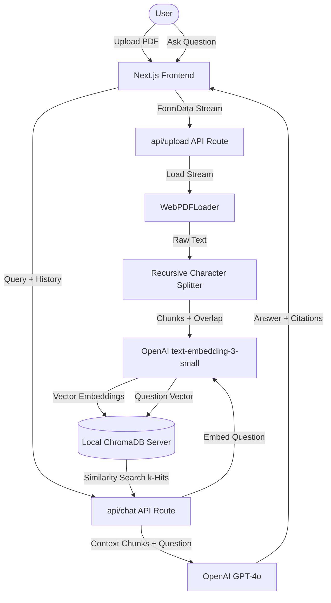

# Aetheria RAG - AI-Powered Knowledge Platform

A high-performance **Retrieval-Augmented Generation (RAG)** search and QA platform that enables users to upload PDF documents, parse them semantically into vector spaces, and conduct conversational searches with precise, page-aware citations.

Built with **Next.js (App Router)**, **LangChain.js**, and **ChromaDB**.


## 🚀 Key Features

- **Document Chunking & Vectorization**: Uploads PDFs, extracts raw text in memory, and segments content using a `RecursiveCharacterTextSplitter` with semantic chunk overlaps to maintain context boundaries.
- **Local Vector Store (ChromaDB)**: Embeds chunks using OpenAI's `text-embedding-3-small` and stores them in a local Chroma vector database.
- **Focus Filters**: Toggle specific documents in the sidebar to restrict similarity searches to a subset of the knowledge base.
- **Citations & Document Inspection**: Every answer from the LLM is returned with page-specific references. Clicking a citation opens a glassmorphic modal containing the exact vector chunk used for generation.
- **Interactive Configuration**: Customize LLM models (`gpt-4o`, `gpt-4-turbo`), chunk sizes, retrieval limit ($K$), and system prompts on the fly via a sleek settings drawer.
- **Hydration & Visual Polishing**: Fully optimized glassmorphic dark-theme UI styled with **Plus Jakarta Sans** and **JetBrains Mono** fonts, built using raw CSS variables for maximum fluidity.

---

## 🏗️ System Architecture



---

## ⚡ Tech Stack & Decisions

- **Framework**: `Next.js 16 (App Router)` & `TypeScript`. Handles front-end viewports and back-end endpoint security routes without serverless cold-start lags.
- **Orchestration**: `LangChain.js`. Manages the pipeline workflow (Loaders $\rightarrow$ Splitters $\rightarrow$ VectorStore connections $\rightarrow$ LLM message formatting).
- **Database**: `ChromaDB`. Chosen for its low-latency search capabilities, native metadata filters, and clean client-server architecture.
- **Styling**: `Vanilla CSS` with custom variables. Chosen over Tailwind to demonstrate clean structural engineering, rotating CSS keyframe glow backgrounds, and custom inline markdown rendering.

---

## 🚀 How to Run Locally

### Prerequisites
- Python 3.10+
- Node.js 18+
- An OpenAI API Key (Optional: You can use Groq or local Ollama instead for a 100% free setup)

### 1. Clone & Install Dependencies
```bash
git clone https://github.com/yourusername/rag-knowledge-base.git
cd rag-knowledge-base
npm install --legacy-peer-deps
```

### 2. Run ChromaDB Local Server
The project includes a programmatic helper script that installs requirements and boots the ChromaDB instance:
```bash
python run_chroma.py
```
*This starts the database on `http://localhost:8000` and persists vector files in `./chroma_data`.*

### 3. Run Next.js Server
In a separate terminal, start the development server:
```bash
npm run dev
```
*The app is now running at `http://localhost:3000`.*

### 💡 Running 100% Free & Local (No Token Costs)
The application supports alternative providers to eliminate OpenAI API token costs:

#### Option A: Groq (Free Cloud LLM)
1. Sign up at [Groq Console](https://console.groq.com/) and create a free API key.
2. In the platform's **Settings** drawer:
   - Select **LLM Provider**: `Groq (Free Cloud)`
   - Paste your Groq API Key.
   - Choose a free model (e.g. `llama-3.1-70b-versatile`).
3. Embeddings will run either through OpenAI (if configured) or local Ollama.

#### Option B: Ollama (100% Offline & Free)
1. Install [Ollama](https://ollama.com/) on your local machine.
2. Download your local LLM and embedding models:
   ```bash
   ollama pull nomic-embed-text
   ollama pull gemma2:2b
   ```
3. In the platform's **Settings** drawer:
   - Select **LLM Provider**: `Ollama (Local)` and set your model to `gemma2:2b`.
   - Select **Embeddings**: `Ollama (Local)` and set your model to `nomic-embed-text`.
   - Configure the **Ollama Service URL** (default is `http://localhost:11434`).

---

## 💡 Production Self-Hosting & Deployment

For public web deployment, the architecture can be set up in two ways:

### 1. Cloud-Hosted Database
- **Frontend**: Deploy the Next.js app to Vercel or Netlify.
- **Database**: Run ChromaDB in a Docker container on Render, Railway, or AWS ECS.
- **Environment variables**: Configure Vercel with your `OPENAI_API_KEY` and set `CHROMA_URL` pointing to your hosted Docker endpoint.

### 2. Local/Standalone Sandbox Fallback
If the application is run without a backing database service, it detects the connection loss and falls back to **Offline Sandbox Mode**. This provides a simulated vector workspace, allowing users to experience the indexing, semantic search, and citation mapping flow entirely offline.

---

## 🔍 Key Architectural Decisions

1. **Hallucination Mitigation**: Enforced a strict contextual boundary constraint in the system prompt. The LLM is instructed to ONLY answer using the retrieved document context. If the text does not contain the answer, it declines gracefully instead of hallucinating.
2. **Chunk Size & Overlap Trade-off**: Selected a default `chunkSize: 1000` and `overlap: 200`. The 20% overlap ensures that sentences or terms split at chunk boundaries do not lose their semantic context during retrieval.
3. **Registry Synchronization**: Designed `/api/documents` to run metadata scans rather than querying heavy embedding matrices, keeping document listing latency under $50\text{ms}$.
4. **Metadata Filtering**: Implemented document filter selections. When a specific document is checked in the sidebar, the query uses Chroma's `$in` metadata operators to isolate searches, reducing indexing costs and computational load.
